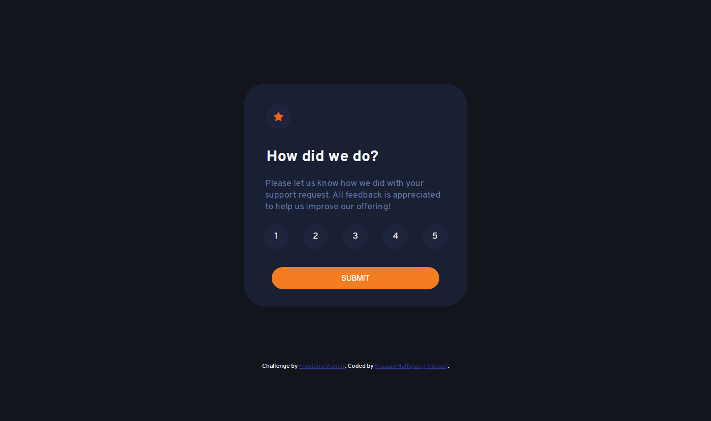

# Frontend Mentor - Interactive rating component solution

This is a solution to the [Interactive rating component challenge on Frontend Mentor](https://www.frontendmentor.io/challenges/interactive-rating-component-koxpeBUmI). Frontend Mentor challenges help you improve your coding skills by building realistic projects.

## Table of contents

- [Overview](#overview)
  - [The challenge](#the-challenge)
  - [Screenshot](#screenshot)
  - [Links](#links)
- [My process](#my-process)
  - [Built with](#built-with)
  - [What I learned](#what-i-learned)
  - [Continued development](#continued-development)
  - [Useful resources](#useful-resources)
- [Author](#author)
- [Acknowledgments](#acknowledgments)

**Note: Delete this note and update the table of contents based on what sections you keep.**

## Overview

### The challenge

Users should be able to:

- View the optimal layout for the app depending on their device's screen size
- See hover states for all interactive elements on the page
- Select and submit a number rating
- See the "Thank you" card state after submitting a rating

### Screenshot



### Links

- Solution URL: [Github](https://github.com/Lord-Nickelbottoms/Interactive-Rating-Component)
- Live Site URL: [Vercel](https://interactive-rating-component-khaki.vercel.app/)

## My process

### Built with

- Semantic HTML5 markup
- CSS custom properties
- Flexbox
- JavaScript

### What I learned

```js
document.getElementsByClassName( 'selection' )[ 0 ].innerText = `You have selected ${ text } out of 5`
```

Using "[ 0 ]" made most things work when it comes to getting elements by their class names.

```js
let button = event.target
	button.setAttribute( "class", "dot checked" )
```

Gained a better understanding with events particularly ```event.target``` however manipulating attributes are what I need to learn more on.

### Continued development

This project outlined how much I still need to learn when it comes to JavaScript DOM manipulation. I'll have to focus on both JavaScript itself (Promises, APIs etc) and its relationship with the DOM.

### Useful resources

- [Mozilla.org](https://developer.mozilla.org/en-US/docs/Learn/JavaScript/Building_blocks/Eventshttps://www.example.com) - This helped me to understand on a deeper level on how to work with events.
- [Javarevisited](https://javarevisited.blogspot.com/2017/08/how-to-enable-disable-element-using-jQuery-JavaScript-example.htmlhttps://www.example.com) - This article helped me to overcome the issue of enabling and disabling an element through a script when the element is disabled in HTML.

## Author

- Github - [Lord Nickelbottoms](https://github.com/Lord-Nickelbottoms)
- Frontend Mentor - [@Lord-Nickelbottoms](https://www.frontendmentor.io/profile/Lord-Nickelbottoms)
- Twitter - [@The_Ur3an_Myth](https://twitter.com/The_Ur3an_Myth?t=YZEwWmRi06-5EVRxhXwnMQ&s=09https://www.twitter.com/yourusername)
